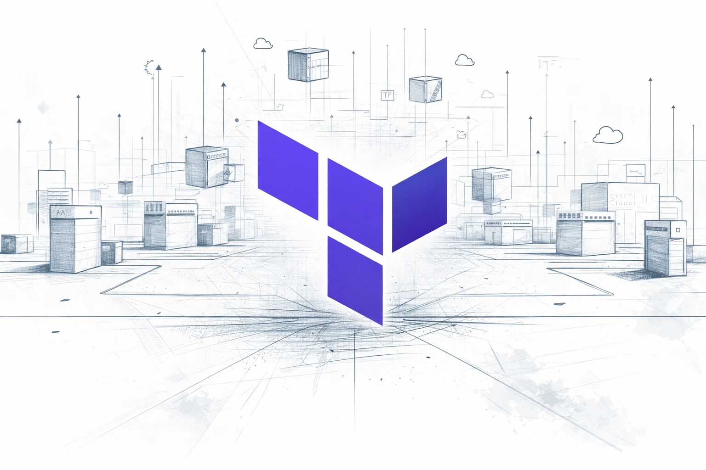

# Terraform Module Bank — GCP, AWS & Azure



**Standalone** Terraform modules for **GCP**, **AWS**, and (future) **Azure**. Each module contains only GCP/resources—no wrapper, no `module { source = "..." }` calls. Names follow GCP product terminology.

## Structure

```
Terrafrom-Module/
├── gcp/           # Google Cloud — VPC, Compute Engine, Storage, Data, IAM, …
├── aws/           # Amazon Web Services (in progress)
├── azure/         # Microsoft Azure (planned)
└── README.md
```

## Usage

Reference modules by path (local or Git). Example — one VPC module (with optional Private Service Access) and a Compute Engine instance:

```hcl
module "network" {
  source       = "./gcp/network"
  project_id   = var.project_id
  network_name = "my-vpc"
  subnets      = [
    { subnet_name = "subnet-01", subnet_ip = "10.10.10.0/24", subnet_region = "us-central1" },
  ]
  enable_private_service_access = true   # for Cloud SQL private IP, etc.
}

module "vm" {
  source                = "./gcp/compute-engine-instance"
  project_id            = var.project_id
  instance_name        = "my-vm"
  zone                 = "us-central1-a"
  subnetwork           = module.network.subnet_self_links["subnet-01"]
  service_account_email = "my-sa@my-project.iam.gserviceaccount.com"
}
```

## GCP modules

| Module | Description |
|--------|-------------|
| **network** | Single VPC module: VPC, subnets, routes, firewall rules, and optional Private Service Access |
| **kubernetes-engine** | GKE cluster and node pools (K8s) |
| **compute-engine-instance** | Compute Engine instance (single VM) |
| **cloud-sql-mysql** | Cloud SQL for MySQL |
| **cloud-storage** | Cloud Storage (GCS) buckets |
| **resource-manager-folders** | Cloud Resource Manager folders and IAM |
| **bigquery** | BigQuery dataset, tables, views |
| **pubsub** | Pub/Sub topic and subscriptions |
| **cloud-nat** | Cloud NAT (optional Cloud Router) |
| **lb-http** | Global HTTP(S) load balancer |
| **cloud-dns** | Cloud DNS managed zone + record sets |
| **kms** | Cloud KMS key ring + keys + IAM |
| **secret-manager** | Secret Manager secrets |
| **log-export** | Log sink (SRE: centralised logging, audit) |
| **iam** | Project IAM bindings |
| **service-accounts** | Service accounts and project roles |

## AWS & Azure

- **AWS:** Placeholder under `aws/`; modules to be added.
- **Azure:** Planned.
